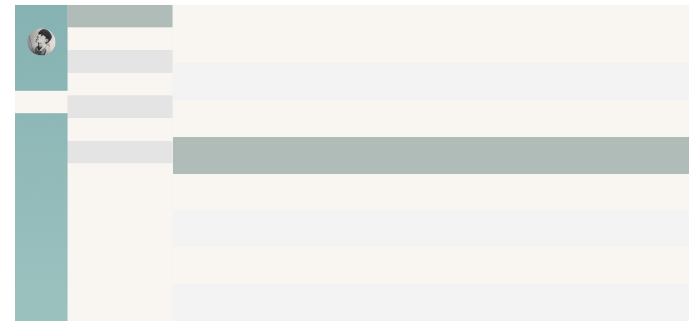

## Vpan
> vue 一个云盘项目，采用webpack构建

### 预期实现功能
- [ ] 文件列表
- [ ] 文件操作
- [ ] 消息推送
- [ ] 多语言
### webpack-多页面配置
#### 项目目录结构
```
    ├─dist (生产目录)
    |	└─static
    |	|  └─css
    |	|  └─images
    |	|  ├─index.hash.js
    |	|  ├─page1.hash.js
    |	|  ├─page2.hash.js
    |	|  ├─...
    |   |
    |   ├─index.html
    |   ├─page1.html
    |   ├─page2.html
    |   ├─...
    |
    └─src (开发目录)
    |   ├─assets (公用资源)
    |   │  └─css
    |   │  └─fonts
    |   │  └─images
    |   │  └─js
    |   │
    |   ├─common (公用组件)
    |   │  └─components
    |   │
    |   └─pages (多页面)
    |       └─index
    |       │  └─components
    |       │  ├─index.html
    |       │  ├─index.js
    |       │
    |       └─page1
    |          └─components
    |          ├─page1.html
    |          ├─page1.js
    |
    └─design (设计资源)
```
### 如何使用？
1. `git clone https://github.com/Redshao/Vpan.git`
2. `cd Vpan`
3. `yarn`或者`yarn install`
4. `npm run dev`之后等待控制台提示success字样
5. 浏览器打开localhost:8000

Tips: 中间步骤可能会出现莫名其妙的问题，别慌，先度娘、后谷爹，再issue
